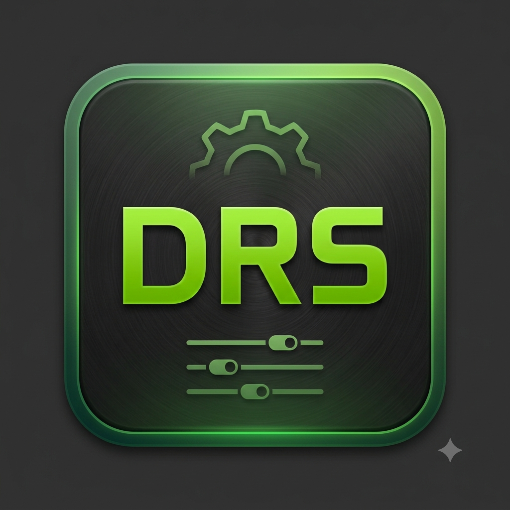

# DRSTool

> ⚠️ **Use at your own risk.** DRSTool changes GPU driver settings and, optionally, system tuning parameters. Read [DISCLAIMER.md](DISCLAIMER.md) before using it.

**DRSTool** is a PySide6 (Qt6) GUI for configuring [dxvk-nvapi](https://github.com/jp7677/dxvk-nvapi) and the NVIDIA DRS (Driver Registry Settings) profile, plus a set of environment-variable builders for Wine, Proton, DXVK, VKD3D-Proton, Gamescope and NVIDIA-specific tuning. It can write the result straight into a Lutris game config.

Turkish version: [README.tr.md](README.tr.md)



## Components

| Component | Path | Description |
|---|---|---|
| DRSTool GUI | `DRSTool.py` | Main application: DRS settings, environment variables, Gamescope flags, profiles, Lutris sync |
| vk_flip_meter (FLM) | `vk-flip-meter-main/` | Vulkan implicit layer for frame pacing on VRR panels and a precise FPS limiter. See its [README](vk-flip-meter-main/README.md) |
| lutris-game-tune | `lutris-game-tune-main/` | Pre/post-game system tuning for Lutris, CCD/CCX core isolation, and lower-nice game startup (setuid C wrapper + Bash) |
| Ebuild | `drstool-9999.ebuild` | Gentoo live ebuild (`games-util/drstool`) that builds and installs all of the above |

## Features

### DRS Settings
- NVIDIA DRS settings with descriptions, grouped by category
- GPU architecture selector (sets `DXVK_NVAPI_GPU_ARCH`)
- Preview of the resulting command/environment before applying

### Environment Variables
The Environment tab covers 238 variables in these groups:

- **DXVK** (incl. `DXVK_HUD` flag grid and the `DXVK_CONFIG` key picker)
- **DXVK forks**: d7vk, dxvk-low-latency, DXVK-Sarek (each labelled with the Proton fork it belongs to)
- **VKD3D-Proton** (`VKD3D_CONFIG` checkbox grid, plus debug/profile variables)
- **DXVK-NVAPI** (DRS settings, Vulkan Reflex layer, logging, NGX debug options)
- **Proton** and **Wine**, including Proton-GE, Proton-EM, Proton-CachyOS and Proton-DW specific flags
- **NVIDIA** `__GL_*` and `__NV_*` variables, PRIME / hybrid-GPU settings
- **NVIDIA Smooth Motion** (NVPresent layer)
- **Wayland input** flags and non-AMD game-optimization flags

Variables that take a fixed set of values are shown as checkboxes or dropdowns; free-form values are text fields.

### Gamescope
Builds `gamescope` command lines from a flag catalog (upscaling, frame pacing, input, session options).

### Profiles
- Save and load full profiles (DRS settings + environment variables)
- XDG-compliant storage: `$XDG_CONFIG_HOME/drstool/` (default `~/.config/drstool/`), written atomically

### Extra Tools
- **vk_flip_meter**: edit FLM settings, live tuning (writes `FLM_CONFIG` and sends `SIGUSR1`)
- **lutris-game-tune**: edit the tuner config and the per-game Lutris settings

### Lutris Game Sync
- Reads and writes a Lutris game's YAML config (`system.*` keys, env vars, Gamescope options, Lutris Game Tune prelaunch/postexit commands)
- Imports settings back from an existing game config ("Load from selected game")
- Only the keys DRSTool manages are changed. Hand-written keys are preserved, and a confirmation dialog lists everything that will be removed

## Requirements

- Linux with an NVIDIA GPU and the proprietary driver (for DRS settings)
- Python 3.12+
- PySide6
- Optional, for specific features: Lutris, Gamescope, Proton/Wine, a Vulkan SDK + CMake (to build FLM)

## Running from source

```bash
pip install PySide6
python3 DRSTool.py
```

## Installing on Gentoo

The included ebuild (`drstool-9999.ebuild`) is a live ebuild that pulls from git.

USE flags:

| Flag | Default | Effect |
|---|---|---|
| `flip-meter` | on | Build and install the vk_flip_meter Vulkan layer (C++) |
| `lto` | off | Build the layer with `-flto` (requires `flip-meter`) |
| `pgo` | off | Two-pass profile-guided optimization for the layer (requires `flip-meter`) |
| `lutris-tune` | on | Install the lutris-game-tune setuid wrapper, script and default config |

```bash
emerge --oneshot games-util/drstool
```

Note: lutris-game-tune requires the setuid-root wrapper. The ebuild sets it up; check it with `lutris-game-tune-wrapper STATUS`.

## Usage notes

- Changes are applied to the selected game's configuration. Read the preview before writing.
- Settings are written to disk; they take effect on the next game launch. lutris-game-tune changes apply on the next PRE run.
- Before every write to a Lutris config, DRSTool creates a timestamped `.bak` copy next to it and keeps the most recent 5.

## Project layout

```
DRSTool.py                 main GUI
assets/drstool.png         application icon
drstool-9999.ebuild        Gentoo ebuild
vk-flip-meter-main/        FLM Vulkan layer (C++, CMake)
lutris-game-tune-main/     Lutris tuner (Bash + setuid C wrapper)
DISCLAIMER.md              risk notice
LICENSE                    MIT
```

## License

MIT. See [LICENSE](LICENSE).

## Disclaimer

This project was developed with AI assistance. It is provided without warranty. See [DISCLAIMER.md](DISCLAIMER.md) for the full text.
